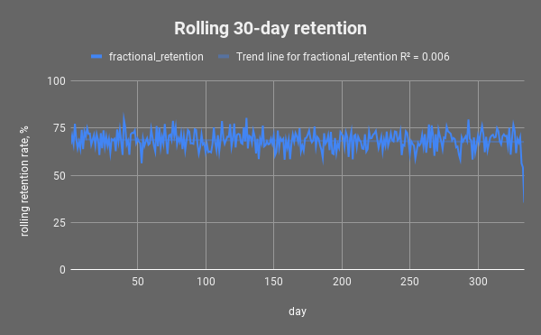
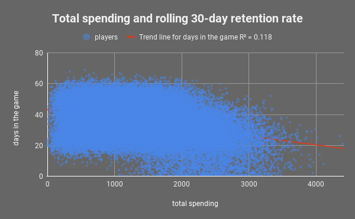

# Retention rate analysis with SQL and Sheets.

## Introduction 

This is a training project made for a JUNO College Data Analytics Bootcamp. 
My partner for this project was [Victor Silvano](https://github.com/VictorSilvano/Juno-Bootcamp)

This project analyses player retention for a mobile game company. 
Specific interest of this analysis is counting the rolling 30-day retention and expressing it as a fraction of the total player base.  
During the analysis We answered following questions:
1. Did a given player play a match 30 days after they joined? 
2. How many players played the game and how many of them were retained?
3. Do players with rolling 30-day retention spend more?
 
## Technologies

- Big Query for a database system
- SQL for a language
- Google Sheets for a data visualisation tool

## Metrics used

The fractional retention for a number of retained players/total number of players

## Queries description 

Full queries can be found in queries.md:

Query 1. For answering first and second question I did 5 nested queries:
1. Using aggregation functions (MAX, MIN) and JOIN between matches_info and player_info
counted what was the day players joined the game and when was the last match they played 
2. Using the CASE statement defined if each player played more or less than 30days
3. Using functions SUM, COUNT, ROUND counted fractional retention, total number of players and a number of retained players
4. Using window function LAG created previous day retention rate
5. Using SAFE_DIVIDE counted rolling fractional retention day after day

Query 2. For answering a third question I wrote a WITH statement with two named sub-queries
1. total_s 
Using JOIN between purchase_info and item_info and functions SUM, ROUND counted how much each player spent in the game
2. retention_rate_by_player
Using JOIN and aggregate functions MIN, MAX counted what was the day they joined the game and when was the last match played 
Using CASE statement defined if each player played more or less than 30days

Using a WITH statement gave me an opportunity to aggregate more data for a future analysis
such as information about players(age, location)

## Queries results can be found in GoogleSheets

https://docs.google.com/spreadsheets/d/12K2GIhoHZVpDoEblvJTlDt8YpZ0f_d3GBT_jawbhs_E/edit?usp=sharing

## Important findings

1. This analysis doesn't include 133 players who installed the game and never played a match in fractional retention count. 
2. Duplicated data were found in the table matches_info. Each match was counted twice, first record for player_id and opponent_id with a "win" and a second record with reversed player_id and opponent_id for "lost". 
3. Only 9 players did not spend money in the game.

## Visualisations

1. On the first chart we track the movement of the 30-day retention rate throughout the year. All days between 334-365 were removed since retention of said days could not be accurately measured. These days would be analysed in the next year. Retention of a player is only achieved if they play a match on the 31st day after their registration day. Chart shows a stable retention rate throughout the year.
  
 
2. A scatter plot shows the spending habits vs player's period of engagement(total days in the game) of every single player. Each dot represents each player. Players who played between 20 and 60 days were spending between 250-2000. Players who spend in the game less days than the chosen retention rate were spending up to 3000.  
 
